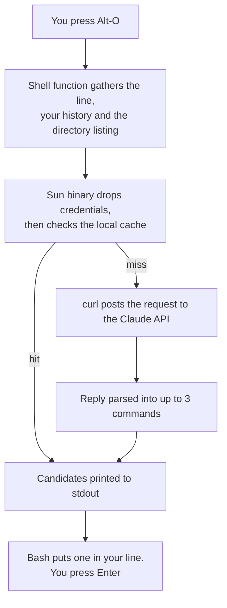

# namo_complete

LLM-powered autocomplete for Bash, written in the
[Sun](https://namo-robotics.github.io/sun/) programming language.


Type as usual. A moment after you pause, a dim hint appears on the bottom line
with the command you are most likely reaching for. Keep typing and it updates or
disappears. Accept it with **Alt-O**, or press
**Alt-A** to see the other candidates. Press **Alt-G** to enter *ask* mode and describe the command you want in plain-English. Accepting a hint puts the command in your line —
**nothing is ever executed**, so you can edit it before pressing Enter.

| Key | Action |
| --- | --- |
| **Alt-O** | Accept the hint |
| **Alt-A** | List the other candidates, pick one by number |
| **Alt-G** | Describe what you want in plain English, pick from described options |

```
$ git com
  hint: git commit -m "..."  (Alt-O) <- hint, while you type
$ git commit -m "..."                <- after Alt-O

$ <Alt-G>
ask> undo my last commit but keep the changes staged
  1) git reset --soft HEAD~1
     Undo last commit, keep changes staged
  2) git revert --no-commit HEAD
     Create revert commit, keep changes staged
  select [1-2]: 1
$ git reset --soft HEAD~1
```

## Install

```bash
curl -fsSL https://raw.githubusercontent.com/namo-robotics/namo_complete/main/install.sh | bash
export ANTHROPIC_API_KEY=sk-ant-...
```

Downloads a prebuilt binary, verifies its SHA-256, installs to `~/.local`, and
adds the source line to `~/.bashrc`. No toolchain, no compiler, no root. Open a
new shell and start typing.

Flags: `--version v0.1.0` (a specific release) or `--version dev` (rolling build
of `main`), `--prefix DIR`, `--no-bashrc`. Without `--version` it takes the
latest stable release, falling back to `dev` if none has been published yet.

**Linux x86_64 only**, plus `bash` 4.4+ and `curl`. `curl` is the HTTPS
transport — Sun's stdlib has no TLS. macOS is unsupported because Sun's C FFI
targets ELF only ([details](SUN_FEEDBACK.md)).

See [what gets sent to Anthropic](#what-gets-sent-to-anthropic) first.

## What gets sent to Anthropic

| Sent | Default | Disable |
| --- | --- | --- |
| The partial command line | always | — |
| Current directory path | always | — |
| Filenames in that directory | 40 | `NAMO_NO_LS=1` |
| Recent shell history | 50 commands | `NAMO_HISTORY_LINES=0` |
| Everything | | `NAMO_DISABLE=1` |

History lines containing a known credential prefix (`sk-`, `ghp_`,
`github_pat_`, `AKIA`, `xoxb-`, `xoxp-`) are dropped before the request is
built. That is the whole filter: it catches pasted keys, not a secret in some
other shape, so set `NAMO_HISTORY_LINES=0` if your shell handles sensitive
material.

## Live hints

The hint appears ~200ms after you stop typing. Always on — there is no switch;
`NAMO_DISABLE=1` turns the whole tool off.

Sourcing the shell file also adds a prompt hook that starts every prompt on a
fresh line, so output with no trailing newline (`curl -s`, `printf`) no longer
gets the next prompt glued to it.

Readline has no line-changed hook, so this rebinds every printable key. That
makes paste slower, changes undo granularity, inserts multi-byte UTF-8
byte-by-byte, and does not cover vi command mode. Rendering is a bottom-line
hint, not inline ghost text — that needs a full line editor such as
[ble.sh](https://github.com/akinomyoga/ble.sh).

A call takes ~700ms, far too slow per keystroke, so the render path only reads
the local cache (~2ms) and never blocks; a debounced background job makes the
request and repaints when it lands.

## Configuration

| Variable | Default | Meaning |
| --- | --- | --- |
| `ANTHROPIC_API_KEY` | — | Required |
| `NAMO_MODEL` | `claude-haiku-4-5` | Any Claude model |
| `NAMO_BIN` | `namo_complete` | Binary path, if not on `PATH` |
| `NAMO_KEY` / `NAMO_ALT_KEY` / `NAMO_ASK_KEY` | `\eo` / `\ea` / `\eg` | Bindings, `bind` syntax |
| `NAMO_DEBOUNCE` | `0.2` | Idle seconds before a live request |
| `NAMO_HINT_MIN` | `3` | Minimum characters before hinting |
| `NAMO_HINT_PREFIX` | `hint: ` | Text in front of the hint row |
| `NAMO_TIMEOUT` | `10` | Seconds before giving up |
| `NAMO_HISTORY_LINES` | `50` | History commands sent; `0` disables |
| `NAMO_LS_LIMIT` / `NAMO_NO_LS` | `40` / `0` | Directory listing |
| `NAMO_MAX_SUGGESTIONS` | `3` | Candidates requested |
| `NAMO_CACHE` / `NAMO_CACHE_TTL` | `1` / `900` | Local cache |
| `NAMO_DISABLE` | `0` | `1` turns everything off |
| `NAMO_ENDPOINT` | Messages API | Override, for testing |

Responses are cached in `~/.cache/namo_complete` (or
`$XDG_CACHE_HOME/namo_complete` if that variable is set), keyed on prefix +
directory + model. Deleting the directory is safe at any time.

## How it works



It starts in bash, and the shell function is the only part that touches your
environment. It takes the partial line from readline, collects the two pieces of
context worth sending — recent history and a listing of the current directory —
and pipes them to the binary on stdin. Collecting the listing here rather than
in the binary is deliberate: it keeps a user-controlled path out of every command
string the binary goes on to build.

The binary does the rest. It drops history lines carrying a credential prefix,
hashes the line, directory and model into a cache key, and returns straight away
if a fresh answer is already on disk. Otherwise it builds the JSON request and
hands it to curl — Sun's standard library has TCP but no TLS, so curl is the
transport as well as the installer.

The reply comes back as at most three command lines on stdout. Bash reads them,
inserts the first or offers the list, and assigns the result to `READLINE_LINE`.
Nothing runs: the command sits in your prompt waiting for you.

Two deliberate properties:

- **No user data reaches the shell.** The binary `chdir`s into its runtime
  directory first, so the `system()` string is a compile-time constant of
  relative literal paths.
- **The API key never appears in `ps`.** It lives in a mode-0600 `curl -K` file
  created with `O_EXCL|O_NOFOLLOW`, unlinked after the request.

The binary is statically linked; `curl` is its only runtime dependency.

## Development

```bash
./run.sh            # try it in the current directory, without installing
./build.sh          # -> bin/namo_complete (needs the Sun compiler)
./test.sh           # offline, against a local mock; no API key
./test.sh --live    # adds one real call, asserts <1.5s
```

`run.sh` and `test.sh` read `.env` (gitignored):

```bash
cp .env.example .env && chmod 600 .env
```

[`.devcontainer/`](.devcontainer/) has an Ubuntu 26.04 image with the toolchain
preinstalled. Every failure mode is silent on stdout, so a missing key, timeout,
or network error leaves the prompt untouched and explains itself on stderr.

## Releases

| Trigger | Release |
| --- | --- |
| merge to `main` | `dev` — rolling prerelease, overwritten each time |
| tag `v*` | immutable versioned release |

[`release.yml`](.github/workflows/release.yml) builds in a container, runs the
tests, verifies the binary is static, installs from the tarball as a smoke test,
then publishes the tarball and `SHA256SUMS`. `install.sh` resolves the newest
*stable* release and only uses `dev` if there is no stable one. Pull requests run
[`ci.yml`](.github/workflows/ci.yml) — same build and tests, no publishing.

## Notes on Sun

Compiler and stdlib gaps this project hit, including two miscompiles, are
written up in [SUN_FEEDBACK.md](SUN_FEEDBACK.md).

## License

See [LICENSE](LICENSE).
