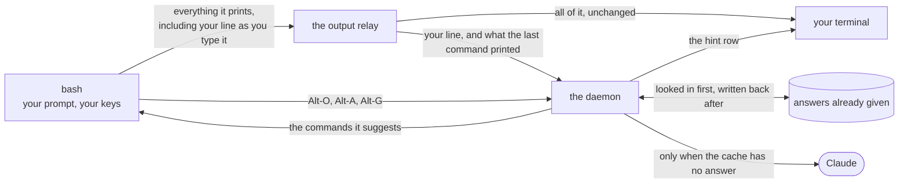

# namo_complete

LLM-powered autocomplete for Bash, written in the
[Sun](https://namo-robotics.github.io/sun/) programming language.


Type as usual. A moment after you pause, a dim hint appears on the row below
your line with the command you are most likely reaching for. Accepting a hint
puts the command in your line — **nothing is ever executed**, so you can edit it
before pressing Enter.

| Key | Action |
| --- | --- |
| **Alt-O** | Accept the hint |
| **Alt-A** | List the other candidates, pick one by number |
| **Alt-G** | Describe what you want in plain English, pick from described options |

```
$ git com
  hint: git commit -m "..."  (Alt-O) <- hint, while you type
$ git commit -m "..."                <- after Alt-O

$ <Alt-G>
ask> undo my last commit but keep the changes staged
  1) git reset --soft HEAD~1
     Undo last commit, keep changes staged
  2) git revert --no-commit HEAD
     Create revert commit, keep changes staged
  select [1-2]: 1
$ git reset --soft HEAD~1

$ gti status
bash: gti: command not found
$                                    <- prompt back at once; nothing waits
  did you mean: git status           <- row below, when the answer arrives
```

Mistype a command and the *command not found* line comes with a **did you
mean**, drawn when the answer arrives — the prompt never waits for it.
`NAMO_DYM=0` turns it off.

## Install

```bash
curl -fsSL https://raw.githubusercontent.com/namo-robotics/namo_complete/main/install.sh | bash
export ANTHROPIC_API_KEY=sk-ant-...
```

That downloads a ready-built program, checks it against the published checksum,
puts it in `~/.local`, and adds one line to your `~/.bashrc` so new shells pick
it up. Nothing is compiled and nothing needs `sudo`. Open a new terminal and
start typing.

Options: `--version v0.1.0` for a particular release or `--version dev` for the
latest build of `main`, `--prefix DIR` to install somewhere else, `--no-bashrc`
to edit your `~/.bashrc` yourself. With no `--version` you get the newest stable
release.

**Linux on x86-64 only**, and you need `bash` 4.4 or newer and `curl` — every
request to Anthropic is made by running `curl`, because Sun cannot yet speak
HTTPS on its own. There is no macOS build; the reason is a limitation in Sun
itself, written up in [SUN_FEEDBACK.md](SUN_FEEDBACK.md).

See [what gets sent to Anthropic](#what-gets-sent-to-anthropic) first.

### Which build am I running?

```bash
namo_complete --version
# namo_complete dev (commit 7be6e48d1c2f, built 2026-08-20T02:04:41Z)
# built with sun 0.dev (46190fcbc286)

namo-version        # the same, plus the paths this shell actually resolved
```

`dev` is overwritten with every change to `main`, so the version name alone does
not say which build you have — the commit does. `namo-version` also prints the
two files this particular shell is using, which is what to compare when one
machine behaves differently from another.

## Uninstall

```bash
rm -f  ~/.local/bin/namo_complete
rm -rf ~/.local/share/namo_complete ~/.cache/namo_complete
sed -i '/# namo_complete/,+1d' ~/.bashrc     # drops the marker and the source line
```

Use whatever path you gave `--prefix`, if you did not install to the default.
The background helpers stop on their own when the shell that started them exits.

## What gets sent to Anthropic

| Sent | Default | Disable |
| --- | --- | --- |
| The partial command line | always | — |
| A command bash could not find | always | `NAMO_DYM=0` |
| What the last command printed | last 10 lines | `NAMO_OUTPUT=0` |
| Current directory path | always | — |
| Filenames in that directory | 40 | `NAMO_NO_LS=1` |
| Recent shell history | 50 commands | `NAMO_HISTORY_LINES=0` |
| Everything | | `NAMO_DISABLE=1` |

Any history line or captured output line that contains something shaped like an
API key (`sk-`, `ghp_`, `github_pat_`, `AKIA`, `xoxb-`, `xoxp-`) is thrown away
before the request is built. That is the whole check: it catches a key you
pasted at a prompt, not a secret that looks like anything else. If you handle
sensitive material in this shell, set `NAMO_HISTORY_LINES=0` and it sends no
history at all.

## Live hints

The hint appears about 200ms after you stop typing, and it is always on: there
is no switch for it, and `NAMO_DISABLE=1` turns off the whole tool. Loading the
shell file also makes every prompt start on a fresh line, so output that does
not end in a newline (`curl -s`, `printf`) no longer has your next prompt stuck
onto the end of it.

The hint goes on the row *under* the one you are typing on. That row is claimed
before the prompt is printed and given back the moment you press Enter, so it
leaves nothing behind in your scrollback. It is a separate row rather than grey
text inside your line, because bash on its own cannot draw inside the line you
are editing; the tools that can, such as
[ble.sh](https://github.com/akinomyoga/ble.sh), replace bash's line editing
entirely.

**Your typing is not intercepted.** Nothing here sits between you and your
keyboard. Bash already prints each character you type, and this tool watches
that stream on its way to the screen and reads the line off it. The obvious
alternative — attaching a handler to every letter key — makes bash rub out and
reprint the whole prompt line on every single character, which shows up as
flicker on terminals that draw as the characters arrive.

Two things follow from that. Watching the stream needs the same stand-in
terminal that captures command output, so `NAMO_OUTPUT=0` stops output being
*kept*, not the watching. And when the line cannot be followed with confidence —
during a Ctrl-R history search, or once what you typed is long enough to wrap
onto a second row — hints stop until the next prompt.

## Configuration

| Variable | Default | Meaning |
| --- | --- | --- |
| `ANTHROPIC_API_KEY` | — | Required |
| `NAMO_MODEL` | `claude-haiku-4-5` | Any Claude model |
| `NAMO_BIN` | `namo_complete` | Binary path, if not on `PATH` |
| `NAMO_KEY` / `NAMO_ALT_KEY` / `NAMO_ASK_KEY` | `\eo` / `\ea` / `\eg` | The three keys, written the way bash's `bind` writes them |
| `NAMO_DEBOUNCE` / `NAMO_QUIET` | `0.2` / `0.05` | Seconds of not typing before a request; how long a burst of typing is left to settle |
| `NAMO_HINT_MIN` | `3` | Minimum characters before hinting |
| `NAMO_HINT_PREFIX` | `hint: ` | Text in front of the hint row |
| `NAMO_TIMEOUT` | `10` | Seconds before giving up |
| `NAMO_DYM` / `NAMO_DYM_PREFIX` | `1` / `did you mean: ` | "did you mean" after *command not found*, and the text in front of it |
| `NAMO_OUTPUT` | `10` | Lines of the last command's output to send; `0` keeps none (hints still work) |
| `NAMO_HISTORY_LINES` | `50` | History commands sent; `0` disables |
| `NAMO_LS_LIMIT` / `NAMO_NO_LS` | `40` / `0` | Directory listing |
| `NAMO_MAX_SUGGESTIONS` | `3` | Candidates requested |
| `NAMO_CACHE` / `NAMO_CACHE_TTL` | `1` / `900` | Local cache |
| `NAMO_DISABLE` | `0` | `1` turns everything off |
| `NAMO_ENDPOINT` | Messages API | Override, for testing |

Answers are cached in `~/.cache/namo_complete`, looked up by what you had typed,
which directory you were in, and which model answered. Deleting that directory
is safe at any time.

## Architecture

Three processes and one program file. Bash owns the line you are typing, because
its own line editor is the only thing that can; the rest belongs to two
background helpers, both of them the same binary started in a different mode:

- **the daemon** — lives as long as your shell, and does all the thinking:
  waiting for you to pause, looking in the cache, calling the API, drawing the
  hint row.
- **the output relay** — holds a *stand-in terminal* (a pseudo-terminal, or pty:
  a pair of endpoints that looks exactly like a real terminal to anything
  writing into it). The shell's output goes there instead of straight to your
  screen, and the relay passes every byte through to the real terminal. On the
  way past it keeps the last few lines your commands printed — that is what it
  is named for — and reads the line you are typing.

The two helpers and the shell talk over *named pipes* — files you write bytes
into at one end and read at the other.



**The shell half** is one file, and deliberately thin: it does only the things
that are impossible outside bash.

- The line you are typing is readable and writable, as `READLINE_LINE`, only
  inside a key handler bash runs for you. Assigning to it is the one way to put
  a command into someone's prompt without running it, and that is what Alt-O
  does — those three keys are the only ones this binds.
- Your shell's history can only be read by the shell itself, so it drops the
  daemon a copy at every prompt.
- The prompt hooks bash offers (`PROMPT_COMMAND`, `PS0`, `PS1`) and its
  "command not found" hook belong to it as well.

**The other half** is a single program that behaves differently depending on how
it is started: as the daemon, as the output relay, or as a plain one-shot run
that reads its input, prints candidates and exits. That last shape is what `run.sh`,
the test suite and any script use, and it is the only one that existed first.

| File | Owns |
| --- | --- |
| [`shell/namo_complete.bash`](shell/namo_complete.bash) | Everything on the bash side: the three keys, the picker, writing your line, both pipes, the prompt hooks and the marker they keep on `PS1`, the "command not found" hook |
| [`src/main.sun`](src/main.sun) | Which mode to run in, the "too little typed to bother" check, and the one-shot path |
| [`src/daemon.sun`](src/daemon.sun) | The daemon: reading the pipe, waiting for you to pause, answering key presses, drawing the hint row |
| [`src/cmd_output_relay.sun`](src/cmd_output_relay.sun) | The stand-in terminal, passing everything through to the real one, following the line you type, keeping the last few lines of output |
| [`src/config.sun`](src/config.sun) | Every setting, read from the environment and nowhere else |
| [`src/prompt.sun`](src/prompt.sun) | What the model is told, what context goes with it, and the request itself |
| [`src/redact.sun`](src/redact.sun) | Throwing away lines that look like they contain a key |
| [`src/client.sun`](src/client.sun) | Running curl, handing it the key privately, reading the reply |
| [`src/cache.sun`](src/cache.sun) | Storing and finding past answers, and the minimum gap between calls |
| [`src/fs.sun`](src/fs.sun) / [`src/util.sun`](src/util.sun) | Files / small helpers: splitting lines, hashing, "does this read like a command", "is this one to stop and check first" |

Two deliberate properties:

- **No shell is ever involved.** `curl` is started directly, with its arguments
  passed one by one, so there is never a command string for a filename or a URL
  to be quoted into. Directories are listed by asking the operating system, not
  by running `ls`.
- **Your API key never shows up in the process list or on disk.** It is fed to
  `curl` on its standard input; only the harmless parts — the URL, the fixed
  headers, the path of the request body — are passed as arguments.

Everything the binary needs is inside the one file — it links nothing at run
time and depends on nothing but `curl`. One source file reaches outside Sun's
standard library: [`cmd_output_relay.sun`](src/cmd_output_relay.sun) calls a handful of C functions
directly (`posix_openpt`, `grantpt`, `unlockpt`, `ptsname`, `ioctl`, `read`,
`open`), because creating a stand-in terminal is the one thing the standard
library cannot yet do. No other file in [`src/`](src/) calls C or uses an
`unsafe` block.

## Development

```bash
./run.sh            # try it here, without installing anything
./build.sh          # -> bin/namo_complete (needs the Sun compiler)
./test.sh           # no API key needed: it answers itself with a local stub
./test.sh --live    # adds one real call, and times it
```

`run.sh` and `test.sh` read `.env`, which is never committed:

```bash
cp .env.example .env && chmod 600 .env
```

[`.devcontainer/`](.devcontainer/) has an Ubuntu 26.04 image with the compiler
already installed. Nothing ever fails loudly into your prompt: a missing key, a
timeout or a network error leaves your line exactly as it was and explains
itself separately.

## Releases

| What happened | What gets published |
| --- | --- |
| a change lands on `main` | `dev` — replaced every time, so it is always the newest build |
| a `v*` tag is pushed | a numbered release, never changed again |

[`release.yml`](.github/workflows/release.yml) builds it in a clean container,
runs the tests, checks that the binary carries everything it needs, installs it
from the release archive as a last check, then publishes the archive with its
checksums. Pull requests run [`ci.yml`](.github/workflows/ci.yml) — the same
build and tests, nothing published.

## Notes on Sun

Sun is young, and the gaps this project ran into — in the compiler and in its
standard library — are written up in [SUN_FEEDBACK.md](SUN_FEEDBACK.md) as
ready-to-file issues, each with a small program that shows the problem. Building
needs the 2026-08-19 version of the standard library or newer; `./build.sh` says
so, and prints the command to update, if the one it finds is older.

## License

See [LICENSE](LICENSE).
