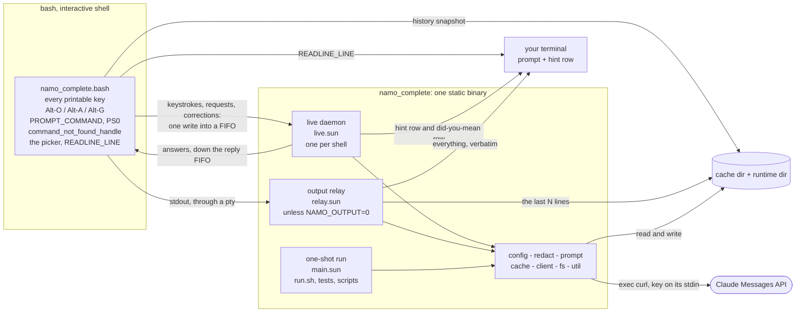
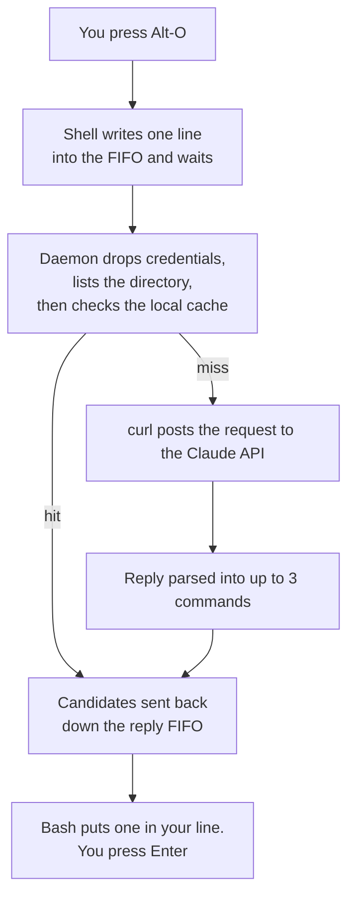

# namo_complete

LLM-powered autocomplete for Bash, written in the
[Sun](https://namo-robotics.github.io/sun/) programming language.


Type as usual. A moment after you pause, a dim hint appears on the row below
your line with the command you are most likely reaching for. Accepting a hint
puts the command in your line — **nothing is ever executed**, so you can edit it
before pressing Enter.

| Key | Action |
| --- | --- |
| **Alt-O** | Accept the hint |
| **Alt-A** | List the other candidates, pick one by number |
| **Alt-G** | Describe what you want in plain English, pick from described options |

```
$ git com
  hint: git commit -m "..."  (Alt-O) <- hint, while you type
$ git commit -m "..."                <- after Alt-O

$ <Alt-G>
ask> undo my last commit but keep the changes staged
  1) git reset --soft HEAD~1
     Undo last commit, keep changes staged
  2) git revert --no-commit HEAD
     Create revert commit, keep changes staged
  select [1-2]: 1
$ git reset --soft HEAD~1

$ gti status
bash: gti: command not found
$                                    <- prompt back at once; nothing waits
  did you mean: git status           <- row below, when the answer arrives
```

Mistype a command and the *command not found* line comes with a **did you
mean**. The prompt returns the instant bash has printed its message; the
correction is handed to the daemon and nothing in the shell waits for it. It
belongs to the command that failed and to nothing else — start typing and it is
gone. It costs a call every time bash cannot find a command, and `NAMO_DYM=0`
turns it off.

## Install

```bash
curl -fsSL https://raw.githubusercontent.com/namo-robotics/namo_complete/main/install.sh | bash
export ANTHROPIC_API_KEY=sk-ant-...
```

Downloads a prebuilt binary, verifies its SHA-256, installs to `~/.local`, and
adds the source line to `~/.bashrc`. No toolchain, no compiler, no root. Open a
new shell and start typing.

Flags: `--version v0.1.0` (a specific release) or `--version dev` (rolling build
of `main`), `--prefix DIR`, `--no-bashrc`. Without `--version` it takes the
latest stable release, falling back to `dev` if none has been published yet.

**Linux x86_64 only**, plus `bash` 4.4+ and `curl`. `curl` is the HTTPS
transport — Sun's stdlib has no TLS. macOS is unsupported because Sun's C FFI,
which its standard library is built on, targets ELF only
([details](SUN_FEEDBACK.md)).

See [what gets sent to Anthropic](#what-gets-sent-to-anthropic) first.

## Uninstall

```bash
rm -f  ~/.local/bin/namo_complete
rm -rf ~/.local/share/namo_complete ~/.cache/namo_complete
sed -i '/# namo_complete/,+1d' ~/.bashrc     # drops the marker and the source line
```

Use the same `--prefix` you installed with, if it was not the default. Nothing
else is left behind: the daemon and the relay exit with the shell that started
them, and their FIFOs go with it.

## What gets sent to Anthropic

| Sent | Default | Disable |
| --- | --- | --- |
| The partial command line | always | — |
| A command bash could not find | always | `NAMO_DYM=0` |
| What the last command printed | last 10 lines | `NAMO_OUTPUT=0` |
| Current directory path | always | — |
| Filenames in that directory | 40 | `NAMO_NO_LS=1` |
| Recent shell history | 50 commands | `NAMO_HISTORY_LINES=0` |
| Everything | | `NAMO_DISABLE=1` |

History lines containing a known credential prefix (`sk-`, `ghp_`,
`github_pat_`, `AKIA`, `xoxb-`, `xoxp-`) are dropped before the request is
built. That is the whole filter: it catches pasted keys, not a secret in some
other shape, so set `NAMO_HISTORY_LINES=0` if your shell handles sensitive
material.

## Live hints

The hint appears ~200ms after you stop typing. Always on — there is no switch;
`NAMO_DISABLE=1` turns the whole tool off. Sourcing the shell file also adds a
prompt hook that starts every prompt on a fresh line, so output with no trailing
newline (`curl -s`, `printf`) no longer gets the next prompt glued to it.

The hint row sits one row below the cursor, is reserved by the prompt hook, and
is given back the moment you press Enter, so nothing is left in the scrollback.

Readline has no line-changed hook, so this rebinds every printable key. That
makes paste slower, changes undo granularity, inserts multi-byte UTF-8
byte-by-byte, and does not cover vi command mode. Rendering is a row under the
line you are typing, not inline ghost text — that needs a full line editor such
as [ble.sh](https://github.com/akinomyoga/ble.sh).

## Configuration

| Variable | Default | Meaning |
| --- | --- | --- |
| `ANTHROPIC_API_KEY` | — | Required |
| `NAMO_MODEL` | `claude-haiku-4-5` | Any Claude model |
| `NAMO_BIN` | `namo_complete` | Binary path, if not on `PATH` |
| `NAMO_KEY` / `NAMO_ALT_KEY` / `NAMO_ASK_KEY` | `\eo` / `\ea` / `\eg` | Bindings, `bind` syntax |
| `NAMO_DEBOUNCE` / `NAMO_QUIET` | `0.2` / `0.05` | Idle seconds before a live request; keystroke coalescing window |
| `NAMO_HINT_MIN` | `3` | Minimum characters before hinting |
| `NAMO_HINT_PREFIX` | `hint: ` | Text in front of the hint row |
| `NAMO_TIMEOUT` | `10` | Seconds before giving up |
| `NAMO_DYM` / `NAMO_DYM_PREFIX` | `1` / `did you mean: ` | "did you mean" after *command not found*, and the text in front of it |
| `NAMO_OUTPUT` | `10` | Lines of the last command's output to send; `0` records nothing |
| `NAMO_HISTORY_LINES` | `50` | History commands sent; `0` disables |
| `NAMO_LS_LIMIT` / `NAMO_NO_LS` | `40` / `0` | Directory listing |
| `NAMO_MAX_SUGGESTIONS` | `3` | Candidates requested |
| `NAMO_CACHE` / `NAMO_CACHE_TTL` | `1` / `900` | Local cache |
| `NAMO_DISABLE` | `0` | `1` turns everything off |
| `NAMO_ENDPOINT` | Messages API | Override, for testing |

Responses are cached in `~/.cache/namo_complete` (or
`$XDG_CACHE_HOME/namo_complete` if that variable is set), keyed on prefix +
directory + model. Deleting the directory is safe at any time.

## Architecture

Two processes and one binary, or three when the last command's output is being
recorded. Bash owns the line, because readline is the only thing that can; the
binary owns everything else.



**The shell half** is one file, and deliberately thin: it does the things only
bash can do and nothing else. `READLINE_LINE` exists only inside a `bind -x`
handler, and assigning to it is the only way to put a command in a prompt
without running it. `fc` is a builtin, so this is the only process that can read
the shell's own history; it leaves the daemon a snapshot at every prompt.
`bind`, `PROMPT_COMMAND`, `PS0` and `command_not_found_handle` are bash's too.
Everything else — what to send, what to keep out of it, what the hint says and
where it goes — is the daemon's.

**The binary half** is one executable, and an interactive shell only ever runs
it once. `NAMO_DAEMON=1` starts the daemon at the first prompt; it holds the
read end of a FIFO for the lifetime of the shell and answers everything that
comes down it. The one-shot shape (read the environment, read history from
stdin, print candidates, exit) is what `run.sh`, the tests and any script use.

**Nothing in the interactive path forks.** That is the whole reason the split
falls where it does: bash blanks the prompt line before running a `bind -x`
handler and repaints it afterwards, so anything a handler waits for is a visible
hole in the line being typed into — and a single fork is enough to see it. So a
keystroke is one `write()` into a pipe. Alt-O, Alt-A and Alt-G are the same
write plus a `read` on a second FIFO, labelled with the id that asked so a stale
answer is dropped rather than mistaken for the next one.

| File | Owns |
| --- | --- |
| [`shell/namo_complete.bash`](shell/namo_complete.bash) | All of the shell side: bindings, the picker, `READLINE_LINE`, both FIFOs, the prompt hook, `command_not_found_handle` |
| [`src/main.sun`](src/main.sun) | One-shot run: mode, the too-short guard, cache, output |
| [`src/live.sun`](src/live.sun) | The daemon: FIFO records, debounce, replies, hint row, directory listing |
| [`src/relay.sun`](src/relay.sun) | The pty the shell's stdout points at, the copy through to the terminal, the last N lines |
| [`src/config.sun`](src/config.sun) | Every setting, from the environment only; the three modes |
| [`src/prompt.sun`](src/prompt.sun) | The three system prompts, the context block, the JSON body |
| [`src/redact.sun`](src/redact.sun) | Dropping history lines that carry a credential prefix |
| [`src/client.sun`](src/client.sun) | `exec`ing curl, the key on its stdin, parsing the reply |
| [`src/cache.sun`](src/cache.sun) | Cache key, lookup, store, and the minimum gap between calls |
| [`src/fs.sun`](src/fs.sun) / [`src/util.sun`](src/util.sun) | Files and descriptors / lines, hashing, "does this read like a command", "is this one to stop on", picking a line out of `history 1` |

Three things cross a process boundary, and nothing else does: history goes into
a file the daemon reads, settings go through the environment when the daemon is
started, and everything after that is one line of text down a FIFO. No shared
memory, no sockets of our own, no serialization format to get wrong.

## How it works



Every keystroke goes down the FIFO as `<cwd><tab><line>`, one `write()` into a
pipe buffer and nothing else; the daemon debounces, reads the cache, makes the
request and draws the hint row on `/dev/tty`. The daemon exits when the shell
that owns the write end goes away.

The binary does the rest: drop history lines carrying a credential prefix, hash
the line, directory and model into a cache key, answer straight away if a fresh
reply is on disk, and otherwise build the JSON request and hand it to curl —
Sun's standard library has TCP but no TLS, so curl is the transport as well as
the installer. The reply comes back as at most three command lines, and bash
assigns one to `READLINE_LINE`. Nothing runs: the command sits in your prompt
waiting for you.

A mistyped command takes the long way round. `command_not_found_handle` runs
after the line has been accepted — there is no `READLINE_LINE` left to write to
— and bash forks around it, so nothing it sets survives and it cannot reach the
FIFO either. Above all it must not make anyone wait. So it writes the line to a
file and returns; the next prompt hook posts that line down the FIFO, and the
daemon pays for the call and draws the answer whenever it arrives. The model
gets its own system prompt for this ([`DYM_SYSTEM_PROMPT`](src/prompt.sun)) in
which "nothing plausible" is an allowed answer, because a confident wrong guess
under *did you mean* is worse than no line at all.

Two deliberate properties:

- **No shell is ever involved.** `curl` is `exec`d directly, one argv entry per
  argument, so there is no command string for a filename or a URL to be quoted
  into. The directory listing is read with `read_dir` rather than by shelling
  out to `ls`.
- **The API key never appears in `ps` or on disk.** It goes down curl's stdin as
  a one-line `-K -` config; everything else — the endpoint, the fixed headers,
  the path of the request body — rides in argv, where it is harmless.

The binary is statically linked; `curl` is its only runtime dependency.
Processes, polling, directories, the environment and the clock all come from
Sun's standard library, and only one file reaches past it:
[`relay.sun`](src/relay.sun) declares `extern "C"` for `posix_openpt`,
`grantpt`, `unlockpt`, `ptsname`, `ioctl` and `read`, because allocating a pty
is the one thing the stdlib cannot do — and without a pty, recording what a
command printed would cost every command its `isatty(1)`. Nothing else in
[`src/`](src/) declares an extern or opens an `unsafe` block.

## Development

```bash
./run.sh            # try it in the current directory, without installing
./build.sh          # -> bin/namo_complete (needs the Sun compiler)
./test.sh           # offline, against a local mock; no API key
./test.sh --live    # adds one real call, asserts <1.5s
```

`run.sh` and `test.sh` read `.env` (gitignored):

```bash
cp .env.example .env && chmod 600 .env
```

[`.devcontainer/`](.devcontainer/) has an Ubuntu 26.04 image with the toolchain
preinstalled. Every failure mode is silent on stdout, so a missing key, timeout,
or network error leaves the prompt untouched and explains itself on stderr.

## Releases

| Trigger | Release |
| --- | --- |
| merge to `main` | `dev` — rolling prerelease, overwritten each time |
| tag `v*` | immutable versioned release |

[`release.yml`](.github/workflows/release.yml) builds in a container, runs the
tests, verifies the binary is static, installs from the tarball as a smoke test,
then publishes the tarball and `SHA256SUMS`. `install.sh` resolves the newest
*stable* release and only uses `dev` if there is no stable one. Pull requests run
[`ci.yml`](.github/workflows/ci.yml) — same build and tests, no publishing.

## Notes on Sun

Compiler and stdlib gaps this project hit are written up in
[SUN_FEEDBACK.md](SUN_FEEDBACK.md) as ready-to-file issue drafts — each with a
standalone reproducer, re-run against the current compiler. The 2026-08-19
stdlib closed three of them: with `sun.process`, `sun.env`, `sun.time`,
`read_dir` and `Poller` in place, every line of FFI this project carried is
gone. Building needs that stdlib or newer; `./build.sh` prints the `apt install`
line for it if the one it finds is older.

## License

See [LICENSE](LICENSE).
