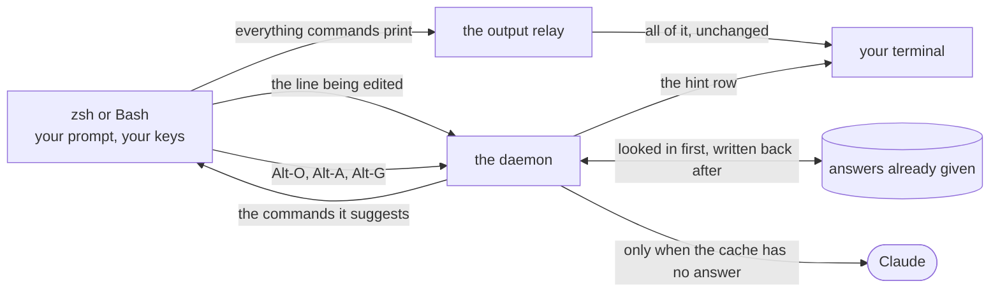

<div align="center">

# namo_complete

[](https://github.com/namo-robotics/namo_complete/actions/workflows/ci.yml) [](https://github.com/namo-robotics/namo_complete/actions/workflows/release.yml)

### A non-obtrusive AI autocomplete for zsh and Bash, written in [Sun](https://namo-robotics.github.io/sun/)

Supports **x86_64 Linux** and **Apple Silicon macOS**

</div>


Type as usual. A moment after you pause, a dim hint appears on the row below
your line with the command you are most likely looking for. Press **Alt-O** to accept the hint, which puts it in your line where
you can edit it before pressing Enter. If you mistype a command, the *command not found* line comes with a **did you mean** hint.
Press **Alt-G** to enter **ask>** mode where you can describe the command that you want in plain English.

| Key       | Action                                                               |
| --------- | -------------------------------------------------------------------- |
| **Alt-O** | Accept the hint                                                      |
| **Alt-A** | List the other candidates, pick one by number                        |
| **Alt-G** | Describe what you want in plain English, pick from described options |


## Install

```sh
curl -fsSL https://raw.githubusercontent.com/namo-robotics/namo_complete/main/install.sh | sh
```

macOS uses its built-in zsh and updates `~/.zshrc`; no Homebrew shell is
required. Linux uses Bash 4.4 or newer and updates `~/.bashrc`.

Then open a new terminal and set `ANTHROPIC_API_KEY`:

```sh
export ANTHROPIC_API_KEY=sk-ant-...
```

The installer selects the Linux x86_64 or macOS arm64 release artifact,
installs the binary plus both shell integrations, and sources the platform
default: zsh on macOS, Bash on Linux.

Options:

| Option             | Env var        | Effect                                                                                                                  |
| ------------------ | -------------- | ----------------------------------------------------------------------------------------------------------------------- |
| `--version vX.Y.Z` | `NAMO_VERSION` | Install a particular release; `dev` takes the latest build of `main`. Default: latest stable, or `dev` if there is none |
| `--prefix DIR`     | `NAMO_PREFIX`  | Install root. Default `~/.local`                                                                                        |
| `--no-rc`          | —              | Skip the `.zshrc` or `.bashrc` edit; add the source line yourself                                                  |


## Uninstall

```sh
rm -f ~/.local/bin/namo_complete
rm -rf ~/.local/share/namo_complete ~/.cache/namo_complete
for rc in ~/.zshrc ~/.bashrc; do
  [ -f "$rc" ] && sed -i.bak "/# namo_complete/,+1d" "$rc" && rm -f "$rc.bak"
done
```
## What gets sent to Anthropic

| Sent                          | Default       | Disable                |
| ----------------------------- | ------------- | ---------------------- |
| The partial command line      | always        | —                      |
| A command the shell could not find | always    | `NAMO_DYM=0`           |
| What the last command printed | last 10 lines | `NAMO_OUTPUT=0`        |
| Current directory path        | always        | —                      |
| Filenames in that directory   | 40            | `NAMO_NO_LS=1`         |
| Recent shell history          | 50 commands   | `NAMO_HISTORY_LINES=0` |
| Everything                    |               | `NAMO_DISABLE=1`       |

Any history line or captured output line that contains something shaped like an
API key (`sk-`, `ghp_`, `github_pat_`, `AKIA`, `xoxb-`, `xoxp-`) is thrown away
before the request is built. That is the whole check: it catches a key you
pasted at a prompt, not a secret that looks like anything else. If you handle
sensitive material in this shell, set `NAMO_HISTORY_LINES=0` and it sends no
history at all.

## Configuration

| Variable                                     | Default                | Meaning                                                                              |
| -------------------------------------------- | ---------------------- | ------------------------------------------------------------------------------------ |
| `ANTHROPIC_API_KEY`                          | —                      | Required                                                                             |
| `NAMO_MODEL`                                 | `claude-opus-5`        | Any Claude model                                                                     |
| `NAMO_BIN`                                   | `namo_complete`        | Binary path, if not on `PATH`                                                        |
| `NAMO_KEY` / `NAMO_ALT_KEY` / `NAMO_ASK_KEY` | `\eo` / `\ea` / `\eg`  | The three shell key sequences                                                     |
| `NAMO_DEBOUNCE` / `NAMO_QUIET`               | `0.2` / `0.05`         | Seconds of not typing before a request; how long a burst of typing is left to settle |
| `NAMO_HINT_MIN`                              | `3`                    | Minimum characters before hinting                                                    |
| `NAMO_HINT_PREFIX`                           | `hint: `               | Text in front of the hint row                                                        |
| `NAMO_ERR_PREFIX`                            | `error: `               | Text in front of the row a failed call draws in place of a hint                      |
| `NAMO_TIMEOUT`                               | `10`                   | Seconds before giving up                                                             |
| `NAMO_DYM` / `NAMO_DYM_PREFIX`               | `1` / `did you mean: ` | "did you mean" after *command not found*, and the text in front of it                |
| `NAMO_OUTPUT`                                | `10`                   | Lines of the last command's output to send; `0` keeps none (hints still work)        |
| `NAMO_HISTORY_LINES`                         | `50`                   | History commands sent; `0` disables                                                  |
| `NAMO_LS_LIMIT` / `NAMO_NO_LS`               | `40` / `0`             | Directory listing                                                                    |
| `NAMO_MAX_SUGGESTIONS`                       | `3`                    | Candidates requested                                                                 |
| `NAMO_CACHE` / `NAMO_CACHE_TTL`              | `1` / `900`            | Local cache                                                                          |
| `NAMO_DISABLE`                               | `0`                    | `1` turns everything off                                                             |
| `NAMO_ENDPOINT`                              | Messages API           | HTTPS override; plaintext is limited to loopback tests                                |

Answers are cached in `~/.cache/namo_complete`, looked up by what you had typed,
which directory and shell you were in, and which model answered. Deleting that directory
is safe at any time.

`NAMO_MODEL` takes any Claude model id. The daemon reads it once, at the first
prompt of a shell, and keeps it for as long as that shell lives -- so changing
it in a shell that is already running means killing the daemon, and the next
prompt starts a new one:

```sh
export NAMO_MODEL=claude-haiku-4-5
kill "$(cat "${XDG_RUNTIME_DIR:-/tmp/namo-$UID}/namo_complete/daemon_pid.$$")"
```

Put the `export` in `~/.zshrc` on macOS or `~/.bashrc` on Linux to make it
stick. `claude-opus-5` is the default for stronger ask-mode answers. The hint
row is drawn while you type, so choose `claude-haiku-4-5` when lower latency
matters more. Current models think before they answer, which is billed out of
the same token budget the answer comes from, so they are asked for a larger one. If a call fails -- a model that does not
exist, a key that has expired, no network -- the row says so instead of staying
empty.

## Architecture

Three processes and one program file. The interactive shell owns the line you
are typing; the rest belongs to two background helpers, both of them the same
binary started in a different mode:

- **the daemon** — lives as long as your shell, and does all the thinking:
  waiting for you to pause, looking in the cache, calling the API, drawing the
  hint row.
- **the output relay** — holds a *stand-in terminal* (a pseudo-terminal, or pty:
  a pair of endpoints that looks exactly like a real terminal to anything
  writing into it). The shell's output goes there instead of straight to your
  screen, and the relay passes every byte through to the real terminal. On the
  way past it keeps the last few lines your commands printed.

The two helpers and the shell talk over *named pipes* — files you write bytes
into at one end and read at the other.



**The shell half** has native integrations for
[zsh](shell/namo_complete.zsh) and [Bash](shell/namo_complete.bash). Both own
history, prompt hooks, keybindings, and command-not-found handling:

- zsh reports `BUFFER` from a ZLE redraw hook. That hook writes to an already
  open FIFO using shell builtins, so typing starts no process and forces no
  extra repaint.
- Bash inserts suggestions through `READLINE_LINE`; its terminal output relay
  observes ordinary typing because Readline does not expose an equivalent
  redraw hook.
- In both shells, accepted suggestions only replace the editable buffer. They
  are never executed until you press Enter.

**The other half** is [`src/`](src/): a single program that behaves differently
depending on how it is started — as the daemon, as the output relay, or as a
plain one-shot run that reads its input, prints candidates and exits. That last
shape is what `run.sh`, the test suite and any script use, and it is the only
one that existed first. Everything else in there is what the daemon calls out
to: settings read from the environment, the prompt and the context that goes
with it, the redaction pass that drops lines looking like keys, the native TLS client,
and the cache.

Two deliberate properties:

- **No transport subprocess is involved.** Sun's verified `TlsStream` sends the
  HTTPS request directly, and plaintext HTTP is accepted only for test
  endpoints. Directories are listed through the standard library, not by
  running `ls`.
- **Your API key never shows up in the process list or on disk.** It stays in
  the namo process and is written directly into the TLS connection.

Release binaries need no curl or OpenSSL runtime dependency. The only native
code outside Sun's bundled libraries is isolated in
[`platform_linux.sun`](src/platform_linux.sun) and
[`platform_macos.sun`](src/platform_macos.sun): PTY allocation, window-size
ioctls, and the read-write nonblocking FIFO open that the current stdlib cannot
express. The shared relay contains no FFI or `unsafe` block.

## Development

```sh
./run.sh            # try it here, without installing anything
./build.sh          # -> bin/namo_complete (needs the Sun compiler)
./test.sh           # no API key needed: it answers itself with a local stub
./test-zsh.sh     # zsh/ZLE and macOS installer regressions
./test.sh --live   # adds one real call, and times it
```

`run.sh` and `test.sh` read `.env`, which is never committed:

```sh
cp .env.example .env && chmod 600 .env
```

[`.devcontainer/`](.devcontainer/) uses the repository's Ubuntu 26.04
image. Builds require the latest Sun dev artifact with matching `stdlib.moon`
and `tls.moon` bundles. Nothing ever fails loudly into your prompt: a missing key, a
timeout or a network error leaves your line exactly as it was and explains
itself separately.

## Notes on Sun

[SUN_FEEDBACK.md](SUN_FEEDBACK.md) records the compiler gaps that shaped the
project, what Sun `8fae619738f4` resolved, and the small platform FFI/borrow
workarounds that remain.

## License

See [LICENSE](LICENSE).
